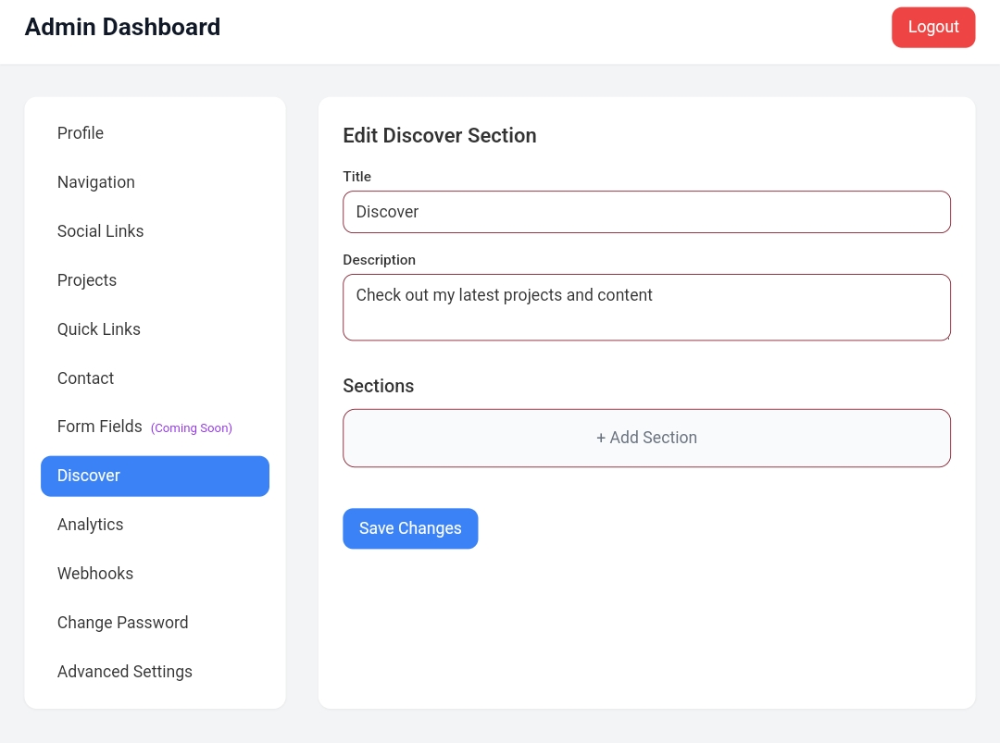

# Amar Portfolio Software

[](https://github.com/harunabdullahrakin/Amar-Portfolio-Software/actions)
[](https://opensource.org/licenses/MIT)
[](https://github.com/harunabdullahrakin/Amar-Portfolio-Software/releases)

Create a stunning portfolio in seconds with an intuitive user interface and seamless admin access.

## **Features**

- **Responsive UI**: Supports both dark and light modes, ensuring an optimal viewing experience across all devices.
- **Easy Customization**: Full control over the dashboard for simple adjustments to suit your personal branding and style.
- **Admin Panel**: Simple backend management for adding, editing, and removing content in your portfolio.
- **Smooth Animations**: Animated sections that add elegance to user interactions.
- **SEO Optimized**: Structured to help your portfolio rank well in search engines.

### **Pages Included**:
- **Home**: Welcome message and introduction to your portfolio.
- **Socials**: Showcase your social media links for easy connection.
- **Projects**: Display your past work with interactive images and descriptions.
- **Contact**: Contact form with email integration to reach you directly.
- **Discover**: Additional section for personal hobbies or extra information.

## **Deployment**

Amar Portfolio Software is easy to deploy on any Node.js hosting platform.

### **Deployment Steps**:
1. Clone the repository:
    ```bash
    git clone https://github.com/harunabdullahrakin/Amar-Portfolio-Software.git
    ```
2. Install dependencies:
    ```bash
    cd Amar-Portfolio-Software
    npm install
    ```
3. Start the server:
    ```bash
    npm start
    ```
4. Open the app in your browser at `http://localhost:3000`.

## **Documentation**

### **Installation**

1. **Download & Extract**: Download the software package and unzip it to your desired directory.
2. **Get the Installation Key**: To unlock full functionality, please reach out via Discord (username: `rakinisawsome`) for the installation key.

Free Key:  
`"ionbehalfofallusersagreetothetermsandconditions"`

## **Demo**

Check out the live demo of Amar Portfolio Software [here](https://amar-portfolio-software.onrender.com/setup).

## **Images/Preview**

Explore the UI design and functionality through the images below:

| Preview | Preview |
|---------|---------|
|  |  |
|  |  |
|  |  |
|  |  |
|  |  |
|  |  |
|  |  |
|  |  |
|  |  |

## **Technologies Used**

Amar Portfolio Software is built using the following technologies:
- **Frontend**: HTML5, CSS3, JavaScript, React.js
- **Backend**: Node.js, Express.js
- **Database**: MongoDB (for admin panel and form submissions)
- **Deployment**: Render, Heroku, DigitalOcean

## **Contributing**

We welcome contributions to improve Amar Portfolio Software. To contribute:
1. Fork the repository.
2. Create a new branch (`git checkout -b feature-xyz`).
3. Make your changes and commit them (`git commit -m 'Add feature xyz'`).
4. Push to the branch (`git push origin feature-xyz`).
5. Create a pull request.

## **License**

This project is licensed under the MIT License - see the [LICENSE](LICENSE) file for details.

---

